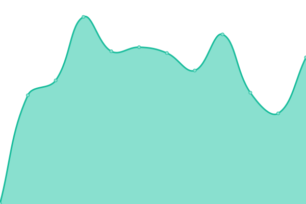

# [📈 Live Status](https://DAUptime.github.io/upptime): <!--live status--> **🟧 Partial outage**

This repository contains the open-source uptime monitor and status page for [DAUptime](https://DAUptime.github.io/upptime), powered by [Upptime](https://github.com/upptime/upptime).

With [Upptime](https://upptime.js.org), you can get your own unlimited and free uptime monitor and status page, powered entirely by a GitHub repository. We use [Issues](https://github.com/DAUptime/upptime/issues) as incident reports, [Actions](https://github.com/DAUptime/upptime/actions) as uptime monitors, and [Pages](https://DAUptime.github.io/upptime) for the status page.

<!--start: status pages-->
<!-- This summary is generated by Upptime (https://github.com/upptime/upptime) -->
<!-- Do not edit this manually, your changes will be overwritten -->
<!-- prettier-ignore -->
| URL | Status | History | Response Time | Uptime |
| --- | ------ | ------- | ------------- | ------ |
|  ABDN | 🟥 Down | [abdn.yml](https://github.com/DAUptime/upptime/commits/HEAD/history/abdn.yml) | 

 1183ms
     
 | 

<a href="https://DAUptime.github.io/upptime/history/abdn">100.00%</a>
    

|  ABDNTEST | 🟩 Up | [abdntest.yml](https://github.com/DAUptime/upptime/commits/HEAD/history/abdntest.yml) | 

 926ms
     
 | 

<a href="https://DAUptime.github.io/upptime/history/abdntest">100.00%</a>
    

|  MVC5 | 🟩 Up | [mvc-5.yml](https://github.com/DAUptime/upptime/commits/HEAD/history/mvc-5.yml) | 

 701ms
     
 | 

<a href="https://DAUptime.github.io/upptime/history/mvc-5">100.00%</a>
    

|  DA | 🟩 Up | [da.yml](https://github.com/DAUptime/upptime/commits/HEAD/history/da.yml) | 

 1694ms
     
 | 

<a href="https://DAUptime.github.io/upptime/history/da">100.00%</a>
    

|  INNOV | 🟩 Up | [innov.yml](https://github.com/DAUptime/upptime/commits/HEAD/history/innov.yml) | 

 725ms
     
 | 

<a href="https://DAUptime.github.io/upptime/history/innov">100.00%</a>
    

|  RANDTEST | 🟥 Down | [randtest.yml](https://github.com/DAUptime/upptime/commits/HEAD/history/randtest.yml) | 

 1079ms
     
 | 

<a href="https://DAUptime.github.io/upptime/history/randtest">0.00%</a>
    

|  RISE | 🟩 Up | [rise.yml](https://github.com/DAUptime/upptime/commits/HEAD/history/rise.yml) | 

 1038ms
     
 | 

<a href="https://DAUptime.github.io/upptime/history/rise">100.00%</a>
    

|  WBTEST | 🟩 Up | [wbtest.yml](https://github.com/DAUptime/upptime/commits/HEAD/history/wbtest.yml) | 

 557ms
     
 | 

<a href="https://DAUptime.github.io/upptime/history/wbtest">100.00%</a>
    

|  WB | 🟩 Up | [wb.yml](https://github.com/DAUptime/upptime/commits/HEAD/history/wb.yml) | 

 491ms
     
 | 

<a href="https://DAUptime.github.io/upptime/history/wb">100.00%</a>
    

<!--end: status pages-->

[**Visit our status website →**](https://DAUptime.github.io/upptime)

## 📄 License

- Powered by: [Upptime](https://github.com/upptime/upptime)
- Code: [MIT](./LICENSE) © [Anand Chowdhary](https://anandchowdhary.com), supported by [Pabio](https://pabio.com)
- Data in the `./history` directory: [Open Database License](https://opendatacommons.org/licenses/odbl/1-0/)
